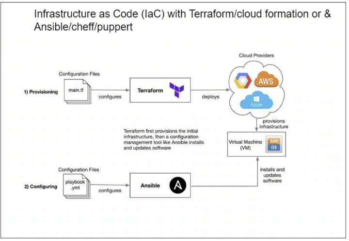

# Infrastructure as Code (IaC)

## What is IaC?
Infrastructure as Code (IaC) is a practice in software engineering that involves managing and provisioning computing infrastructure through machine-readable definition files, rather than physical hardware configuration or interactive configuration tools. IaC allows infrastructure management to be automated and provides a consistent and reproducible way to deploy and manage infrastructure.

### Configuration Management
- **Ansible**
  - Automation tool
  - Open source
  - Extremely powerful but simple to use
  - Agentless
    - Ansible does not need to be installed on the systems that it is operating on
  - Uses YAML (scripting language)
    - Human readable
    - Cross-platform compatibility - Multiple industry tools use YAML

### Orchestration
- **Terraform**
  - Infrastructure as Code tool
  - Open source
  - Declarative language
    - Describe the desired state of the infrastructure
  - Multi-cloud support
    - Works with major cloud providers like AWS, Azure, Google Cloud
  - State management
    - Tracks the state of the infrastructure
  - Resource management
    - Manages various cloud resources such as VMs, networks, storage
  - Infrastructure provisioning
    - Automates the creation, update, and deletion of infrastructure resources

## How Ansible and Terraform can be used to orchestrate and configure an infrastructure

