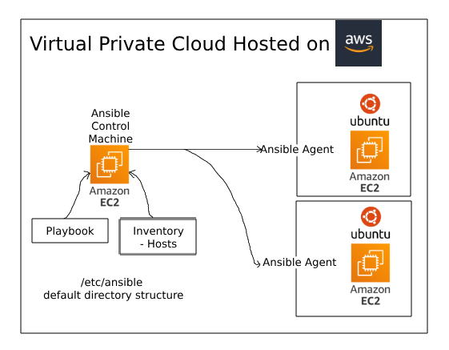
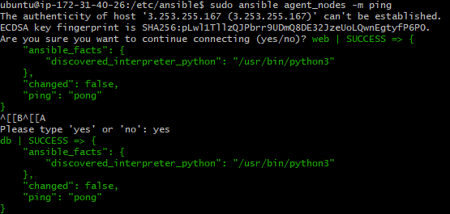
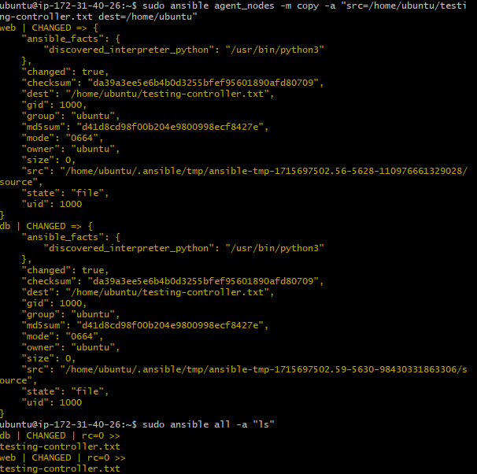

# Ansible - What? Why? When? How?

## What is Ansible?

- **Ansible** is an open-source automation tool that aims to simplify IT orchestration, configuration management, and application deployment.

## Why should we use Ansible?

- Ansible should be used because it helps in automating repetitive tasks, ensuring consistency across systems, and reducing human error in IT operations.

## When should Ansible be used?

- **Ansible** should be used when there is a need to manage configurations across multiple servers efficiently, deploy applications consistently, and automate routine tasks in a scalable manner.

## How can we use Ansible?

- Ansible can be used by defining playbooks in YAML format that describe the desired state of systems, running Ansible commands or playbooks on the control node, and leveraging Ansible modules to interact with remote systems for configuration management and automation.

## The Architecture of Ansible
The architecture of Ansible is based on the cloud, I specifically use AWS EC2 instances.

### A high level overview of Ansibles Architecure

- **3 instances**:
    1. **Ansible Controller**:
        - Default location: /etc/ansible
        - Contains:
            - Playbook
                - Ansible tests
                - playbooks.yml
            - Inventory
                - Hosts file
                    - Contains endpoints
                    - Used to test if the host is available
                    - Contains the IP addresses of agent nodes

    2. **2 Agent Nodes**:
        - Security Group Rules:
            - Port 22 open for the controller to SSH

### A Diagram of Ansible Architecture


## Setting up the Ansible Architecture
Update and upgrade all 3 instances
`sudo apt update -y`
`sudo apt upgrade -y`

### Configuring the controller instance
`sudo apt-get install software-properties-common`
`sudo apt-add-repository ppa:ansible/ansible`
`sudo apt-get install ansible -y`
`sudo ansible --version`

On your local machine, scp your pem file onto your controller
`scp -i ~/.ssh/tech258.pem ~/.ssh/tech258.pem ubuntu@3.254.202.61:~/.ssh/`


`cd /etc/ansible/`
Use `sudo nano hosts` and enter the details of your agent nodes:
```
[agent_nodes]
web ansible_host=3.248.185.150
db ansible_host=63.35.172.1

[agent_nodes:vars]
ansible_user=ubuntu
ansible_ssh_private_key_file=~/.ssh/tech258.pem
```
This can also be done in one line:<br>
`web ansible_host=<YOUR_APP_IP> ansible_user=ubuntu ansible_ssh_private_key_file=~/.ssh/tech258.pem`

Then run this to test the agent nodes are accessible.
`sudo ansible agent_nodes -m ping`<br>

This is the desired output:<br>


To view some basic info of the agent nodes, use the following command:
`sudo ansible agent_nodes -a "uname -a"`

More information on other ad hoc commands [here](https://docs.ansible.com/ansible/latest/command_guide/intro_adhoc.html)

Copying a file over from your controller to your agent nodes:
`sudo ansible agent_nodes -m copy -a "src=/home/ubuntu/testing-controller.txt dest=/home/ubuntu"`

Expected output:<br>


## Creating an Ansible playbook to install nginx on our app instance

Ansible playbooks are written in YAML.

```
# YAML starts with three dashes
---
# add the name of the host web
- hosts: web
# see the logs gather facts
  gather_facts: yes
# provide admin access - sudo
  become: yes
# add instructions to install nginx on the web server
  tasks:
  - name: Installing nginx web server
    apt: pkg=nginx state=present
# ensure nginx is in a running state
```


I got the app code onto my controller using:<br>
`git clone https://github.com/Martin-Muraskovas/cicd_learning.git`
<br>

## Installing node:
```
---
- hosts: web

  gather_facts: yes

  become: yes

  tasks:
  - name: Installing node
    apt: pkg=nodejs state=present
```


## Script to provision the app environment and run the app

```
---
- hosts: web
  gather_facts: yes
  become: yes
  tasks:
    - name: Update package lists
      apt:
        update_cache: yes

    - name: Upgrade packages
      apt:
        upgrade: yes
        autoremove: yes

    - name: Installing nginx web server
      apt: pkg=nginx state=present
    
    - name: Installing node
      apt: 
        pkg: nodejs
        state: present

    - name: remove app so new one can be cloned
      shell: |
        rm -r cicd_learning
        apt-get install npm -y

    - name: clone app github repository
      shell: |
        git clone https://github.com/Martin-Muraskovas/cicd_learning

    - name: Update and upgrade apt packages
      apt:
        upgrade: yes
        update_cache: yes

    - name: install pm2
      shell: |
        cd /home/ubuntu/cicd_learning/app
        npm install
        npm install pm2@4.0.0 -g
        pm2 kill
        pm2 start app.js
```

DB playbook:
```
---
- hosts: db

  gather_facts: yes

  become: true

  tasks:
  - name: Update package lists
    apt:
      update_cache: yes


  - name: Upgrade packages
    apt:
      upgrade: yes
      autoremove: yes

  - name: install and configure Mongodb
    apt: pkg=mongodb state=present
```