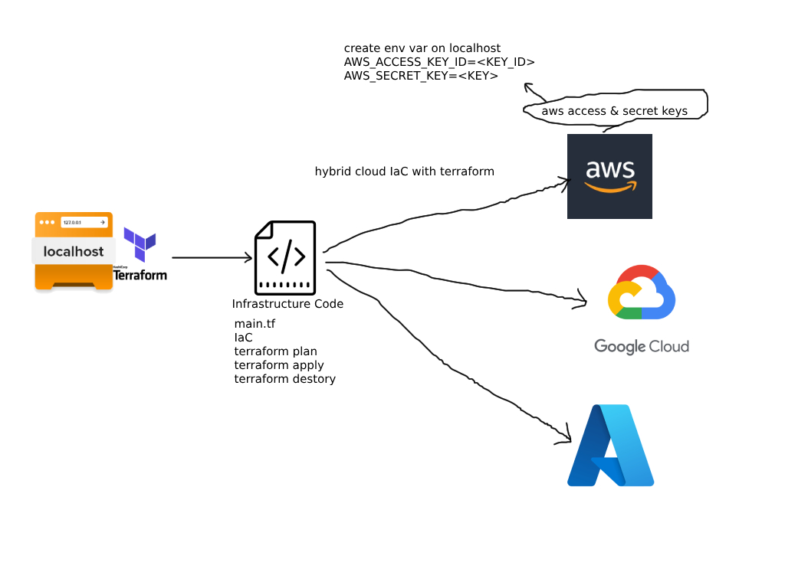
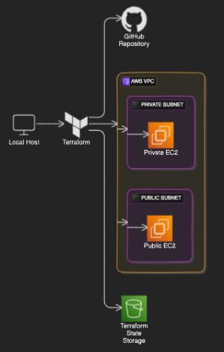
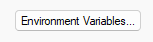
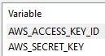
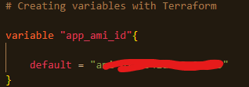
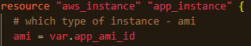
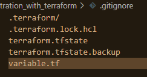
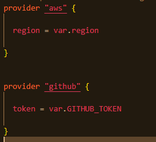
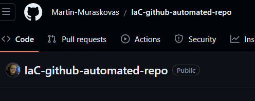

# Terraform - What? Why? When? How?

## What is Terraform?
Terraform is an open-source infrastructure as code software tool created by HashiCorp. It enables users to define and provision data center infrastructure using a declarative configuration language, allowing for the automation of resource management.

## Why should we use Terraform?
- Open source
- Widely used in the industry
- Fintech companies require multi-cloud deployment
- Terraform allows for the use of multiple cloud providers

## When should we use Terraform?
Terraform should be used:
- When you need to automate the deployment and management of infrastructure resources efficiently.
- When you want to maintain consistency and version control for your infrastructure configurations.
- When you aim to adopt infrastructure as code practices for scalability and reproducibility in your environment.

## How can we use Terraform?
Install terraform using this [guide](https://developer.hashicorp.com/terraform/tutorials/aws-get-started/install-cli). You can now use `terraform` commands on your CLI of choosing.

## Diagram of Terraforms architecture


## Creating our environment variables on localhost
- `AWS_ACCESS_KEY_ID=<KEY_ID>`
- `AWS_SECRET_KEY=<KEY>`

On Windows search "Edit the system environment variables" and select this option:<br>


Click this button:<br>


Under the system variables section, click new and create 2 new environment variables:<br>
<br>

## Creating an EC2 instance on AWS using Terraform

Begin by navigating to the folder of your choosing and then entering the `terraform init` command.<br>

Create a main.tf file using `nano main.tf`<br>

:boom: NEVER HARDOCODE THE KEYS<br>

:boom: DO NOT PUSH ANYTHING TO GITHUB UNTIL WE HAVE CREATED A .gitignore FILE<br>

```
# Create a service on the cloud - launch an EC2 instance on AWS

# Which part of AWS - We want Ireland
provider "aws" {
  region = "eu-west-1"
}

# which service/resource/s - ec2
resource "aws_instance" "app_instance" {
  # which type of instance - ami
  ami = "ami-02f0341ac93c96375"

  # t2.micro
  instance_type = "t2.micro"
  
  # associate public ip with this instance
  associate_public_ip_address = true
  
  # name the ec2/resource
  tags = {
    Name = "martin-terraform-tech258-app"
  }
}
```

Save your main.tf file.

To run your EC2 instance using Terraform, run the following commands:<br>
- `terraform plan`
- `terraform apply`


## Keeping your Terraform files secure
Use the following syntax to decalare variables:

<br>

Use the following syntax to reference these variables in your main.tf file:



Add your variables file to your .gitignore file:




## Using multiple services within Terraform
You can use multiple services at once within terraform by declaring the multiple providers that you want to use, in my case I will be using github.

This is the syntax to declare more than one provider in Terraform:



Notice that different providers require different information, AWS needs the region while github needs your Personal Access Token.

### Creating a new github repository using Terraform

1. Create a Personal Access Token

   Create a personal access token [here](https://github.com/settings/tokens).

   Ensure to copy the token to use with terraform as you will no longer be able to see it after you leave this page.

2. Provide terraform access to github.

    Declare github as a provider and enter your PAT. Remember not to hardcode your PAT so use the principles outlined [here]() to safely provide your token to terraform.

    ```
    resource "github_repository" "automated_repo" {
    name        = var.repo_name
    description = "terraform repo"
    visibility  = "public"  # Change to "private" if needed
    }
    ```

3. Run the usual commands

    Run `terraform plan` and `terraform apply` to create your new github repo.

    

    Refresh your github and your new repo should appear.